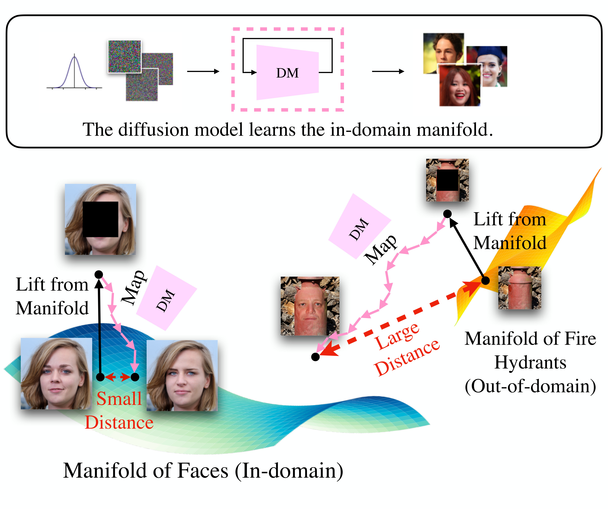

# Unsupervised Out-of-distribution Detection with Diffusion Inpainting

This is the official repo for

[**Unsupervised Out-of-distribution Detection with Diffusion Inpainting**](https://arxiv.org/abs/2302.10326) (ICML 2023)

by Zhenzhen Liu*, Jin Peng Zhou*, Yufan Wang, and Kilian Q. Weinberger \
*Equal Contribution



## Abstract
Unsupervised out-of-distribution detection (OOD) seeks to identify out-of-domain data by learning only from unlabeled in-domain data. We present a novel approach for this task -- Lift, Map, Detect (LMD) -- that leverages recent advancement in diffusion models. Diffusion models are one type of generative models. At their core, they learn an iterative denoising process that gradually maps a noisy image closer to their training manifolds. LMD leverages this intuition for OOD detection. Specifically, LMD lifts an image off its original manifold by corrupting it, and maps it towards the in-domain manifold with a diffusion model. For an OOD image, the mapped image would have a large distance away from its original manifold, and LMD would identify it as OOD accordingly. We show through extensive experiments that LMD achieves competitive performance across a broad variety of datasets.

## Citation
```
@article{liu2023unsupervised,
  title={Unsupervised Out-of-Distribution Detection with Diffusion Inpainting},
  author={Liu, Zhenzhen and Zhou, Jin Peng and Wang, Yufan and Weinberger, Kilian Q},
  journal={arXiv preprint arXiv:2302.10326},
  year={2023}
}
```

## Environment
The environment can be created by running the commands in `create_environment.sh` with Conda and pip.

To install the SimCLR similarity metric, please see [this](https://github.com/google-research/simclr) and [this](https://github.com/Separius/SimCLRv2-Pytorch). The checkpoint `r50_1x_sk1.pth` should be put under `pretrained/`.

## Usage
To train a DDPM model on datasets such as CIFAR10:
```bash
python main.py --workdir results/cifar10/ --config configs/subvp/cifar10_ddpm_continuous.py --mode train
``` 

After training the model or with a pretrained checkpoint, we can perform inpainting by:
```bash
python recon.py --config configs/subvp/cifar10_ddpm_continuous.py --ckpt_path results/cifar10/checkpoints/checkpoint_20.pth --in_domain CIFAR10 --out_of_domain SVHN --batch_size 200 --mask_type checkerboard_alt --mask_num_blocks 8 --reps_per_image 10 --workdir results/cifar10/CIFAR10_vs_SVHN/
``` 

To evaluate ROC-AUC with LPIPS similarity metric, simply run:
```bash
python detect.py --result_path results/cifar10/CIFAR10_vs_SVHN/checkerboard_alt_blocks8_reps10/ --reps 10 --metric LPIPS
``` 
## Datasets
Most datasets will be automatically downloaded. For ImageNet and CelebA-HQ datasets, a manual download is needed. After downloading them, a txt file that contains the path to individual images on each line is needed to run inpainting in `recon.py`.

## Acknowledgement
This work built upon excellent open-source implementations from [Yang Song](https://yang-song.net/). Specifically, we adapted his Pytorch DDPM implementation ([link](https://github.com/yang-song/score_sde_pytorch)). We also adapted great work from [SimMIM](https://github.com/microsoft/SimMIM) and [SimCLRv2-Pytorch](https://github.com/Separius/SimCLRv2-Pytorch).